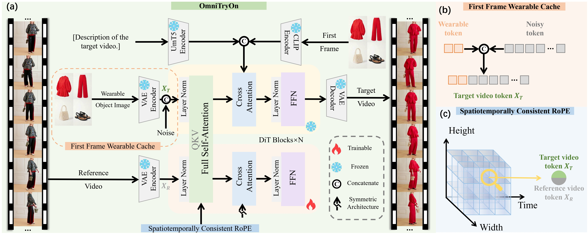
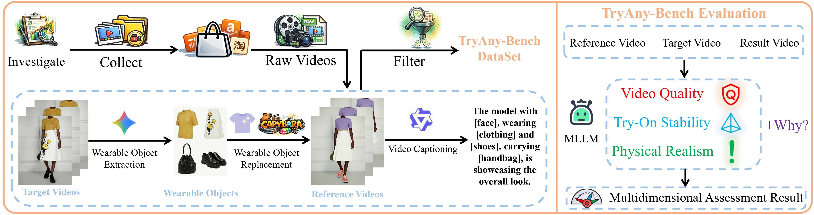

<h1 align="center">
OmniTryOn: Video Try-On Anything at Once!
</h1>
<p align="center">
  <a href="https://xcltql666.github.io/OmniTryOnProj/"><b>[🌐 Website]</b></a> •
  <a href="https://arxiv.org/"><b>[📜 Paper]</b></a> •
  <a href="https://huggingface.co/xcll/omnitryon_model"><b>[🤗 HF Models]</b></a> •  
  <a href="https://huggingface.co/datasets/xcll/Try-Any-Bench"><b>[🤗 HF Dataset]</b></a> •  
</p>


<p align="center">
Repo for "<a href="https://arxiv.org" target="_blank">OmniTryOn: Video Try-On Anything at Once!</a>"
</p>


## OmniTryOn Model


## TryAny-Bench Benchmark


##  News

- _2025.06_:  We will release the <a href="https://huggingface.co/datasets/xcll/Try-Any-Bench"><b>[TryAny-Bench]</b></a> in two days.

- _2025.06_:  We release the checkpoints of the <a href="https://huggingface.co/xcll/omnitryon_model"><b>[OmniTryOn model]</b></a>.


## Installation
Create a virtual environment and install the required dependencies:
```bash
conda create -n omnitryon python=3.12
conda activate omnitryon
Install all the necessary dependencies
```


## Training
```bash
bash DiffSynth-Studio\examples\wanvideo\model_training\full\Video-As-Prompt-Wan2.1-14B.sh
```

## Inference
```bash
python DiffSynth-Studio\examples\wanvideo\model_training\validate_full\Video-As-Prompt-Wan2.1-14B.py
```

## Acknowledgment
Thanks to <a href="https://huggingface.co/Wan-AI/Wan2.1-T2V-14B" target="_blank">
Wan2.1-T2V-14B</a> for their powerful model, <a href="https://huggingface.co/ByteDance/Video-As-Prompt-Wan2.1-14B" target="_blank">Video-As-Prompt</a> and <a href="https://github.com/modelscope/DiffSynth-Studio" target="_blank">DiffSynth-Studio</a> for their wonderful open-sourced work.

## Citation
If you find it helpful, please kindly cite the paper.
```

```

## 📬 Contact

If you have any inquiries, suggestions, or wish to contact us for any reason, we warmly invite you to email us at 202066@stu.xjtu.edu.cn or cp3jia@stu.xjtu.edu.cn.
